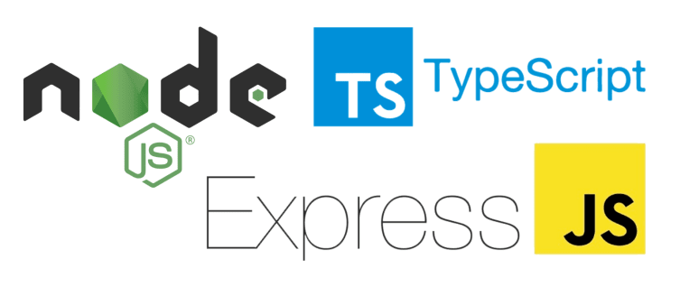

# Node API REST with Typescript




> Rest API using node, typescript, express, mongoDB and jest

---

## 💻 Getting Started

Before you begin, check that you have met the following requirements:

- Latest version of `NodeJs`.
- You have a database in `mongoDB`, you can do this for free from MongoDB Atlas.
- Create .env in the root with the following variables:
  - MONGO_URL: Your url mongoDB;
  - TOKEN_SECRET and TOKEN_EXPIRATION: for functionalities of jwt.

---

## 🚀 Setup

Install dependencies:

```
npm i or yarn
```

Build (not necessary):

```
npm run build
```

Running:

```
npm run dev
```

You can see all other scripts on package.json.

---
